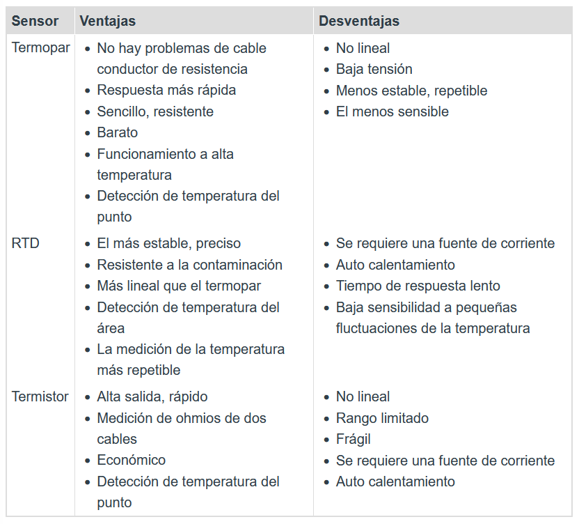
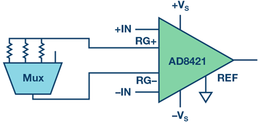
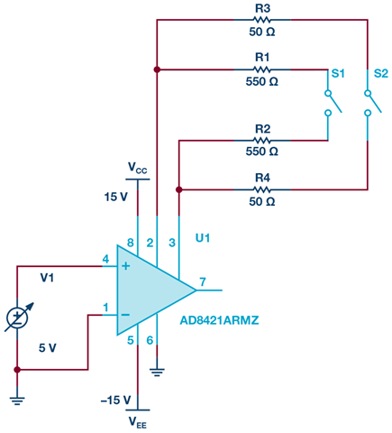
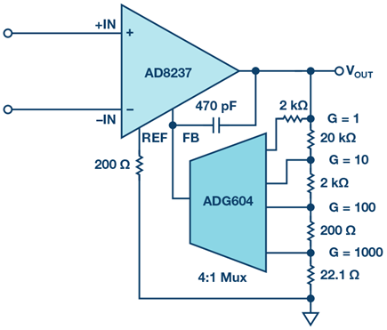
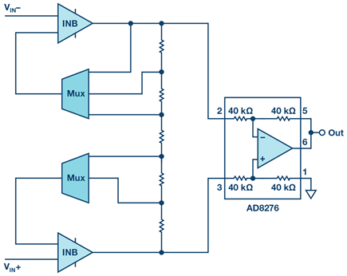
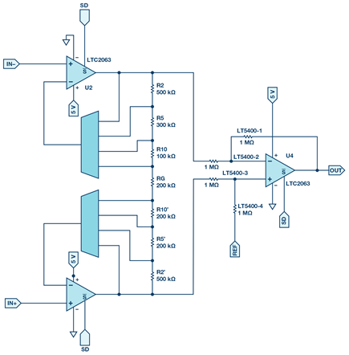

## 1. Cuestionario previo
### 1.1 ¿Cuales son los tipos de sensores de temperatura más populares? ¿Cuáles son sus ventajas y desventajas en función de los requisitos del diseño?
#### Termistor
Un termistor es un dispositivo para medir temperatura que está hecho de un material semiconductor compacto. Este material tiene la característica de cambiar mucho su resistencia cuando la temperatura cambia un poco. Por lo general, los termistores tienen una propiedad interesante: cuando la temperatura sube, su resistencia disminuye, y esto se debe a que tienen un coeficiente de temperatura negativo [5].

#### RTD (Resistencia de temperatura)
Un RTD (Detector de Temperatura por Resistencia) es un sensor cuya resistencia cambia a medida que cambia su temperatura. La resistencia aumenta a medida que la temperatura del sensor aumenta. La relación entre resistencia y temperatura es bien conocida y se repite con el tiempo. Un RTD es un dispositivo pasivo. No produce una salida por sí mismo. Se utilizan dispositivos electrónicos externos para medir la resistencia del sensor al pasar una pequeña corriente eléctrica a través del sensor para generar un voltaje. Por lo general, se utiliza una corriente de medición de 1 mA o menos, con un máximo de 5 mA sin riesgo de auto-calentamiento[6].

#### Termocupla o termopar
Estos dispositivos de detección están compuestos por dos cables hechos de diferentes materiales que están conectados en un extremo. La parte donde se quiere medir la temperatura se expone allí. Además, los otros extremos de los cables están sin conectar para que se pueda medir la fuerza termo electromotriz que se genera en el sensor.

Debido a su pequeño tamaño y capacidad de respuesta rápida, estos sensores son muy útiles para medir la temperatura en entornos desafiantes[6].

#### Ventajas y Desventajas
A continuacion, se mostrara una tabla que representa las ventajas y desventajas que existen entre los diferentes sensores de temperatura mencionados anteriormente.
.

La imagen fue recuperada de [7].

Finalmente, para el presente laboratorio el sensor de temperatura tipo termopar, porque es el solicitado y al mismo tiempo el mas barato y sencillo de usar para la aplicacion.

### 1.2 ¿Cuales son los tipos de termocuplas? ¿Cuales son sus rangos de temperatura y tensión?

A continuacion, se describen los diferentes tipos de termocuplas y sus rangos de lectura [8].
#### Termocupla Tipo B

Poseen características muy parecidas a las de los modelos R y S. Aunque tienen mayor estabilidad, su sensibilidad es menor, lo que conlleva a que su uso sea principalmente para medir temperaturas que superan los 300 °C y llegan hasta los 1800 °C.

Este tipo de sensor también puede ser conveniente para emplearse en ambientes al vacío por periodos breves. Sin embargo, es importante destacar que no se recomienda su uso en entornos que contengan vapor o que sean reductores, ya sea de naturaleza metálica o no metálica. Además, se debe evitar introducir directamente este equipo en tubos protectores de metal y, en su lugar, se requiere la utilización de aislantes cerámicos de alta alúmina y tubos protectores.

#### termocupla Tipo E
Es apto para su uso en ambientes con aire, gases inertes o donde no hay presión atmosférica. No es recomendable emplearlo en lugares donde los ambientes cambien entre oxidación y reducción.

En comparación con otras termocuplas comúnmente usadas, este tipo presenta una potencia termoeléctrica más elevada, lo cual es especialmente beneficioso para quienes necesitan detectar cambios mínimos de temperatura.

Su rango de funcionamiento se extiende desde 0 grados Celsius hasta 870 grados Celsius.

#### Termocupla Tipo J
Es adecuado para su aplicación en ambientes que pueden ser reductores, neutros o incluso oxidantes. Sin embargo, su empleo no es aconsejable en atmósferas con niveles significativos de humedad y tampoco en temperaturas bajas, debido a que el componente termoeléctrico JP podría volverse frágil en estas condiciones.

El rango de funcionamiento de este termoelemento abarca desde 0 grados Celsius hasta 760 grados Celsius.

#### termocupla Tipo K

Se caracteriza por ser versátil en su aplicación. Su precio es asequible y debido a su amplia aceptación, se encuentra disponible en una variedad de modelos de sondas. Este producto es capaz de medir temperaturas en un rango extenso que va desde -200°C hasta 1260°C.

#### Termocupla Tipo N
Su notable estabilidad y su capacidad para resistir la oxidación a temperaturas elevadas lo convierten en una elección preferida para mediciones en ambientes de alta temperatura, sin la necesidad de recurrir a termocuplas que contengan platino en su composición, como los tipos B, R y S. Fue concebido como una versión avanzada en la categoría tipo K.

Este sensor abarca un rango de temperaturas desde 0 hasta 1260 grados Celsius.

#### termocupla Tipo S
Es viable emplear este dispositivo en ambientes que son inertes o incluso oxidantes. Cuando se somete a altas temperaturas de manera constante, mantiene un nivel de estabilidad admirable a lo largo del tiempo, el cual es superior al que poseen las termocuplas no basadas en platino.

No obstante, es fundamental evitar la exposición de los componentes termoeléctricos de esta herramienta a atmósferas que sean reductoras o que contengan vapores de metal. Para asegurar su funcionamiento adecuado, se recomienda no insertar estos elementos directamente en tubos protectores de metal. En cambio, se debe emplear inicialmente un tubo de protección cerámica que cumpla con ciertas especificaciones: fabricado con alúmina (Al2O3) de alta pureza (99.7%) conocido comercialmente como tipo 799 (anteriormente 710).

Este sensor de temperatura tiene un rango de operación desde 0 hasta 1480 grados Celsius.

#### Termocupla Tipo T
Es apto para ser utilizado en ambientes inertes, oxidantes o incluso reductores. Su capacidad de proporcionar mediciones precisas se debe a la uniformidad con la que el cobre, el material con el que se procesa, se comporta.

Sin embargo, es importante señalar que cuando se expone a temperaturas superiores a 300°C, el cobre experimenta una oxidación significativa, lo que afecta negativamente su vida útil y puede provocar desviaciones en la curva de respuesta original.

Este sensor de temperatura opera dentro de un rango que va desde -200°C hasta 370°C.

#### termocupla Tipo R

Comparten las propiedades de las termocuplas Tipo S, lo que los hace apropiados para medir temperaturas de hasta 1600 °C. Sin embargo, debido a su precio más elevado, su adopción en la industria en general no es tan común.

El rango de funcionamiento de estos sensores de temperatura se extiende desde 0°C hasta 1600°C.

 ### 1.3 ¿Qué es una señal balanceada y una no balanceada? ¿Qué aplicación tiene el uso de señales balanceadas?
 
Una señal balanceada y una señal no balanceada son conceptos que se refieren a la forma en que se transmiten las señales eléctricas a lo largo de un cable o un sistema de comunicación. Estos términos son comunes en el ámbito de la electrónica y las comunicaciones.

Señal No Balanceada:
Es aquella en la que la información se transmite a través de un solo conductor en relación a un conductor de referencia, que generalmente es el conductor de tierra (o común). La señal se diferencia del conductor de referencia en términos de voltaje eléctrico, y esto hace que esté más susceptible a interferencias electromagnéticas y ruido.[10]

Señal Balanceada:
Una señal balanceada es aquella en la que la información se transmite a través de dos conductores idénticos, pero opuestos en polaridad, en relación a un conductor de referencia común, que suele ser el conductor de tierra. En este tipo de señal, la diferencia de voltaje entre los dos conductores es lo que transporta la información. Debido a que ambas líneas transportan la misma información pero con polaridades opuestas, cualquier interferencia que afecte a ambas líneas de manera igual (interferencia común) se cancelará automáticamente en el receptor. Esto hace que las señales balanceadas sean más resistentes al ruido y la interferencia.[10]

Aplicación del Uso de Señales Balanceadas:

Las señales balanceadas se utilizan en muchas aplicaciones donde la integridad de la señal es crítica y donde es necesario minimizar la interferencia y el ruido. Algunos ejemplos de aplicaciones incluyen:

Audio Profesional: En equipos de audio profesional, como micrófonos, cables de línea y sistemas de sonido en vivo, se utilizan señales balanceadas para reducir el ruido y la interferencia, lo que mejora la calidad del sonido.

Comunicación en Larga Distancia: En sistemas de comunicación de larga distancia, como transmisiones de audio o video, las señales balanceadas ayudan a mantener la calidad de la señal a lo largo de cables largos y en entornos con interferencia electromagnética.

Redes de Datos: En aplicaciones de redes y telecomunicaciones, como Ethernet, se utilizan pares trenzados balanceados para transmitir datos, lo que ayuda a minimizar la interferencia y mejora la velocidad y confiabilidad de la transmisión.

Instrumentación y Mediciones: En aplicaciones donde se requiere precisión en las mediciones, como en instrumentación científica y médica, se utilizan señales balanceadas para reducir la posibilidad de errores causados por interferencia.

Video Profesional: En la transmisión y distribución de señales de video de alta calidad, como en la industria del cine y la televisión, las señales balanceadas ayudan a mantener la integridad de la señal a medida que viaja por distancias largas.

En resumen, las señales balanceadas son ampliamente utilizadas en situaciones donde la calidad de la señal y la reducción del ruido son esenciales para un funcionamiento confiable y preciso del sistema.

### 1.4 ¿ Qué es el aislamiento eléctrico entre dos tierrras? ¿En los diseños electrónicos qué vantajas tiene el aislamiento entre señales?

Para el caso de tierras no aisladas en un solo sistema, agregarlas de esta manera al sistema puede resultar en lazos a tierra, los cuales son fuentes de ruido comunes en aplicaciones de medidas. Estos lazos a tierra ocurren cuando dos terminales conectadas en un circuito están en potenciales a tierra distintos, esto provoca que la corriente fluya entre dos puntos. La tierra de la fuente de señal puede ser de varios volts por encima o debajo de la tierra del instrumento. Cuando esto ocurre, el voltaje adicional puede ser causante de error en la medida y la corriente que fluye puede inducir voltajes en cables cercanos, lo cual ocasiona errores de medida. El aislamiento eléctrico entre dos tierras permite que no haya interacción entre los componentes que comparten un mismo sistema pero no interactúan de manera directa [1].

Algunas ventajas del aislamiento entre señales es [2]:

- Reducción de interferencias internas y externas.
- El sistema es sensible únicamente a las entradas deseadas.
- La potencia de la señal se mantiene idealmente íntegra dentro del sistema.
- Los componentes no interactúan entre otros.

### 1.5 Investigue diseños electrónicos para aislar eléctricamente señales DC o de baja frecuencia (<100Hz).
Algunos diseños electrónicos que se utilizan para aislar eléctricamente señales de baja frecuencia:

Transformadores de aislamiento: Los transformadores son dispositivos eficaces para aislar señales de baja frecuencia. Pueden proporcionar un aislamiento galvánico entre las partes primaria y secundaria. En aplicaciones de baja frecuencia, como señales DC o señales de hasta 100 Hz, los transformadores pueden ser adecuados. Sin embargo, los transformadores pueden tener limitaciones en términos de ancho de banda y tamaño.[11]

Optoacopladores (optoaisladores): Los optoacopladores son dispositivos que utilizan acoplamiento óptico para aislar eléctricamente señales. Consisten en un LED emisor y un fotodetector en un mismo paquete. Cuando se aplica un voltaje a la entrada del LED, emite luz que activa el fotodetector, generando una señal en la salida. Los optoacopladores son útiles para aplicaciones de baja frecuencia y ofrecen un buen aislamiento galvánico.[11]

Amplificadores de instrumentación aislados: Los amplificadores de instrumentación aislados son circuitos que amplifican y aislan señales de baja frecuencia al mismo tiempo. Estos dispositivos suelen incluir aislamiento galvánico mediante transformadores o técnicas optoacopladoras. Son muy utilizados en aplicaciones de medición de precisión donde se requiere un alto nivel de aislamiento.[11]

Circuito de amplificación diferencial con filtro paso bajo: Este diseño implica la utilización de un circuito de amplificación diferencial seguido de un filtro paso bajo para atenuar cualquier ruido de alta frecuencia. El diseño diferencial ayuda a rechazar el ruido común y la interferencia. El filtro paso bajo se ajusta para limitar la banda de frecuencia de interés.[11]

Conversores analógico-digitales aislados (ADC aislados): En aplicaciones donde se necesita convertir una señal analógica de baja frecuencia en una señal digital, los ADC aislados pueden ser útiles. Estos dispositivos convierten la señal analógica a digital mientras mantienen el aislamiento eléctrico entre la entrada y la salida.[11]

Dispositivos basados en tecnología capacitiva: Los aisladores capacitivos pueden utilizarse para transmitir señales de baja frecuencia a través de un aislamiento dieléctrico. Estos dispositivos se basan en la variación de la capacitancia y se utilizan a menudo en aplicaciones industriales.[11]

### 1.6 Investigue diseños de amplificadores con ganancia programable.
Un circuito de ganancia programable permite al usuario amplificar el valor de un dato de entrada con la facilidad de establecer la ganancia deseada manualmente o mediante un microcontrolador, diseños de amplificadores con ganancia programable se muestran a continuacion [9].

Utilizando el AD8421 con un multiplexor (mux) para lograr ganancia conmutada. En este arreglo, la resistencia de activación del mux se encuentra efectivamente conectada en línea con la resistencia de ganancia. 

Implementando un Amplificador de Ganancia Instrumental Programable (PGIA) de manera discreta mediante una disposición equilibrada. En esta situación, se aconseja la utilización de un interruptor cuádruple de un solo polo y un solo tiro (SPST) como el ADG5412F. Además de brindar la capacidad de emplear resistencias equilibradas, el interruptor también asegura que las capacidades estén equilibradas tanto para el drenaje como para la fuente, minimizando así la disminución en la relación de rechazo del modo común (CMRR).

Creando un Amplificador de Ganancia Instrumental Programable (PGIA) de forma discreta mediante el uso de amplificadores de entrada con una configuración de retroalimentación de corriente indirecta. En estos amplificadores, la magnitud de la amplificación se configura a través de la proporción de las resistencias externas, similar al proceso en un amplificador no inversor. Esto otorga al usuario mayor flexibilidad, ya que las resistencias empleadas para ajustar la ganancia pueden ser seleccionadas según las necesidades específicas del diseño.

Diseño discreto de Amplificador de Ganancia Instrumental (PGIA). La selección de los amplificadores de entrada está intrínsecamente vinculada a los requisitos de Adquisición de Datos (DAQ). Por ejemplo, si el diseño busca conservar la energía, serán adecuados los amplificadores de baja corriente de reposo. Por otro lado, en sistemas que anticipan la conexión de sensores de alta impedancia en la entrada, se pueden emplear amplificadores con corrientes de polarización muy bajas para reducir al mínimo el margen de error.

Creación de un PGIA con enfoque en la eficiencia energética. En la etapa secundaria del amplificador diferencial, se empleó el LTC2063 junto con la configuración de resistencias combinadas cuádruples LT5400, específicamente con resistencias de 1 MΩ. Esto garantiza que la corriente extraída sea mínima y que la Relación de Rechazo del Modo Común (CMRR) se mantenga, gracias a la precisión en la combinación de las resistencias.

### 1.7 Investigue cómo se mide el rechazo de modo común para una señal diferencial y el rechazo de croostalk entre dos canales

Para el caso de medición para el rechazo de modo común se debe dividir la ganancia en modo diferencial contra la ganancia en modo común [3].

$$ CMRR= \dfrac{Av_{dif}}{Av_{cmr}} $$

Para el caso de rechazo de croostalk este se mide con el análisis de pasar una señal por el canal 1 de un osciloscopio y medir su influencia en $dB$ sobre el segundo canal que no está siendo alimentado por otra señal externa. Mediante el osciloscopio se observan los $dB$ que tiene el canal sin entrada y se obtiene el porcentaje de rechazo de crosstalk que presenta el circuito [4].

## 2 Bibliografía

[1] National Instruments. "Consideraciones de Conexión a Tierra para Medidas Mejoradas". Disponible en: https://www.ni.com/es/shop/data-acquisition/measurement-fundamentals-main-page/analog-fundamentals/grounding-considerations-for-improved-measurements.html. Acceso: 27 de agosto de 2023.

[2] Ramón Pallas Areny. Diseño con amplificadores operacionales y circuitos integrados analógicos. Tercera Edición, McGraw Hill. México, 2005.

[3] Gerard, G. "Qué es la CMRR o relación de rechazo de modo común?. Youtube, 2023. [En línea]. Disponible en https://www.youtube.com/watch?v=-uj1TNaxxco&ab_channel=GuillermoGerard%3AVide%C3%ADtosparamifuturoyo , Acceso: 27 de agosto de 2023.

[4] En clave de retro. "Aprende Electrónica: Crosstalk (diafonía)," YouTube, 2023. [En línea]. Disponible en: https://www.youtube.com/watch?v=Cv5zNkC4-ao&ab_channel=EnClavedeRetro . Acceso en: 27 de agosto de 2023.

[5] OMEGA Engineering : Customer Service Center. (s. f.). https://mx.omega.com/prodinfo/termistor.htm

[6] Pelgrom, M. (2022). Analog-to-Digital conversion. En Springer eBooks. https://doi.org/10.1007/978-3-030-90808-9

[7] Guía de comparación de sensores de temperatura | Watlow. (s. f.). https://www.watlow.com/es-es/resources-and-support/engineering-tools/knowledge-base/temperature-sensors-comparison-guide.

[8] Mind Design - https://www.mind.art.br. (s. f.). Termocupla, cómo funciona, tipos, consejos y modelos. | Alutal. Copyright © - https://www.alutal.com.br. https://www.alutal.com.br/es/termopar

[9] Amplificadores de instrumentación de ganancia programable: encontrar uno que funcione para usted-Electron-FMUSER proveedor integral de transmisión de FM / TV. (s. f.). https://es.fmuser.net/content/?17416.html

[10] Godoy, D. (2023) MB101: Conexiones balanceadas y no balanceadas - guía total, Musical Boutique. Disponible en: https://musicalboutique.co/blogs/blog-mb/mb101-conexiones-balanceadas-y-no-balanceadas-guia-total (Accesado: 28 Agosto 2023). 

[11] Baker, B. (2018) Cómo aislar altos voltajes en Sistemas Robóticos Industriales de Alimentación única, DigiKey. Disponible en: https://www.digikey.com/es/articles/how-to-isolate-high-voltages-industrial-robotic-systems (Accesado: 28 Agosto 2023). 
