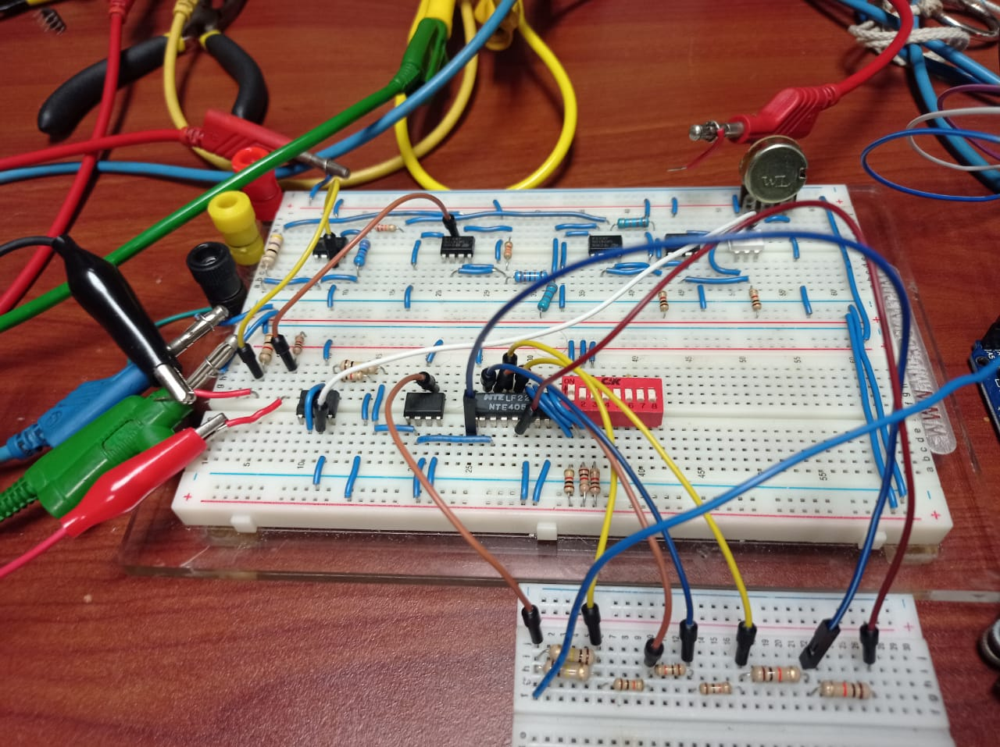
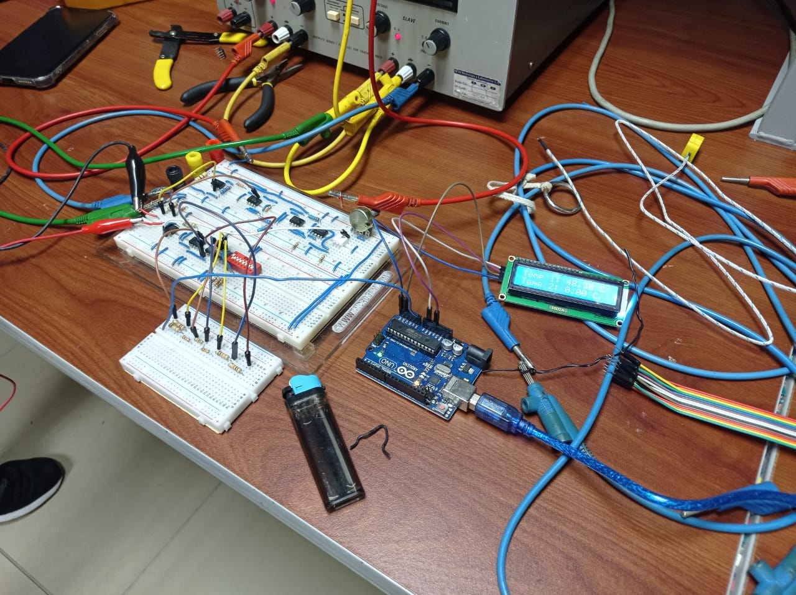

Se optó por realizar la conexión de un solo canal para corroborar la funcionalidad y minimizar gastos. El circuito final se observa en la siguiente fotografía:

A continuación se muestra el circuito con el montaje final y las conexiones de los instrumentos de medición.

En la grabación de funcionamiento final podemos observar al canal uno desplegando una temperatura entre 36 y 47 grados celsius aproximadamente en el lcd.

https://github.com/fabianchs/taller_instru_lab2/assets/26722437/5bd5f0f0-1acb-42af-8a68-3ee6f83ffa6e

