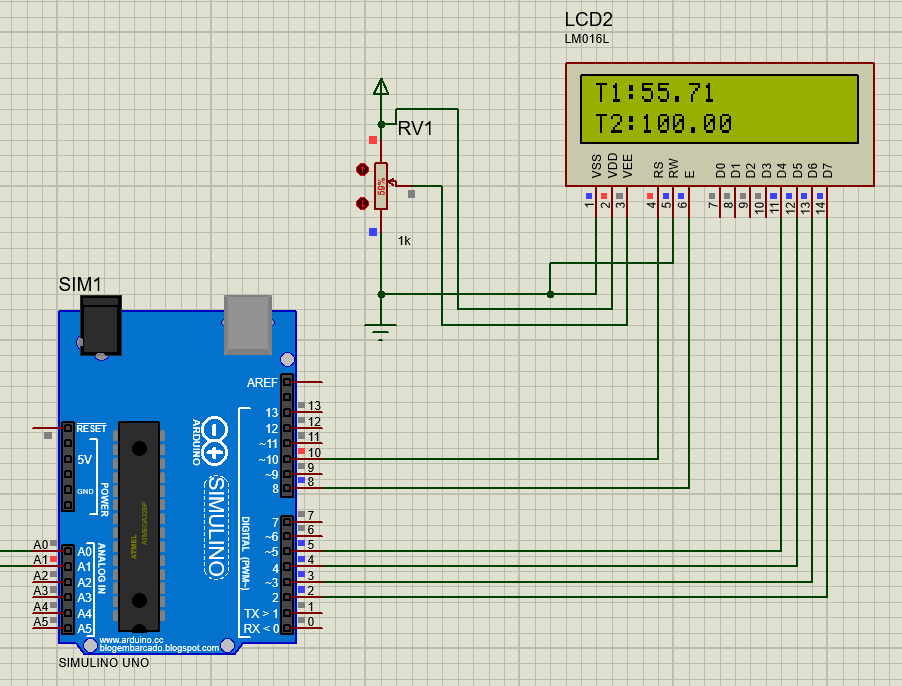

## Simulaciones
### Etapa 1
En la primera etapa se toma el valor de voltaje de la termocupla, se pasa por un amplificador de instrumentacion y luego se aisla electricamente con un optoacoplador, se busca una ganancia de 1000, por lo tanto, la salida se tiene en el orden de V y no de mV. El esquematico de la primera etapa se muestra a continuacion.

### Etapa 2

Luego en la segunda etapa mediante un multiplexor y un amplificador en configuracion inversora se selecciona la escala deseada para la salida de la etapa 1 y 2, se escogieron 6 escalas distintas (10V, 1V, 100mV, 10mV, 1mV, 100uV), el esquimatico de la segunda etapa se muestra a continuacion.

### Etapa 3

Finalmente, en la tercera etapa, se hace uso de un arduino uno y un lcd para poder apreciar la temperatura leida desde la primera entrada en forma de voltaje. A continuacion, se muestran los resultados.

