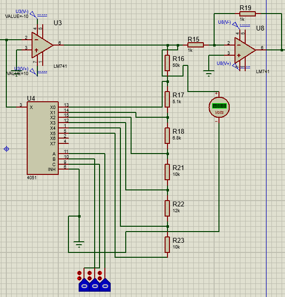

## Simulaciones (Proteus)
### Etapa 1
En la primera etapa se toma el valor de voltaje de la termocupla, se pasa por un amplificador de instrumentacion y luego se aisla electricamente con un optoacoplador, se busca una ganancia de 1000, por lo tanto, la salida se tiene en el orden de V y no de mV. El esquematico de la primera etapa se muestra a continuacion.


### Etapa 2

Luego en la segunda etapa mediante un multiplexor y un amplificador en configuracion inversora se selecciona la escala deseada para la salida de la etapa 1 y 2, se escogieron 6 escalas distintas (10V, 1V, 100mV, 10mV, 1mV, 100uV), el esquimatico de la segunda etapa se muestra a continuacion.




### Etapa 3

En la etapa 4 se usa un optoacoplador para aislar las tierras del circuito, de esta forma se puede conectar la alimentacion y la tierra que proporciona el arduino para tener una lectura mas estable.


La grafica de voltaje por grado centigrado a la salida de la etapa 1 y 2 usada como referencia para poder pasar de digital a analogico nuevamente dentro de la programacion del arduino es la siguiente.


### Etapa 4
En la ultima etapa se conecta el arduino junto con el display lcd como se muestra en la siguiente imagen:


### Programacion Arduino
Finalmente, la programacion del arduino es la siguiente.
<div style="background-color: rgb(50, 50, 50);">
```arduino
//Definiciones
const int t1 = A0; // Temperatura de la termocupla 1
const int t2 = A1; // Temperatura de la termocupla 2
float temp1;       // Variable que armazenará la temperatura medida 1
float temp2;       // Variable que armazenará la temperatura medida 2
int value1;         //Variable entera para almacenar la conversión ADC 1
int value2;         //Variable entera para almacenar la conversión ADC 2

//Bibliotecas
#include <LiquidCrystal.h> 
LiquidCrystal lcd(10, 8, 5, 4, 3, 2); //(RS, E, D4,D5, D6, D7)
 
 
void setup() {
 lcd.begin(16, 2);   // Inicia el LCD 16x02 (columnas,filas)
 lcd.home();         // Coloca el cursor en las coordenadas (0,0)
 lcd.print("T1:");   // Escribe en el LCD 
 lcd.setCursor(0,1); // Coloca el cursor en las coordenadas (0,1)
 lcd.print("T2:");   // Escribe en el LCD 
} 
 
//Función que será ejecutada continuamente
void loop() {
  //Lectura del Pin A0 (ADC)
  //value=analogRead(LM35); // Almacena el valor entero.
  //Conveierte el valor entero en Temperatura
  //temperatura=(value*5.0/1023.0) / 0.01;
  
  temp1 = ((float(analogRead(t1))*(8.8/1023))/0.0761290322);     //temperatura 1
  temp2 = ((float(analogRead(t2))*(8.8/1023))/0.0761290322);     //temperatura 2
  
  
  lcd.home();         // Coloca el cursor en las coordenadas (7,1)
  lcd.print("T1:");   // Escribe en el LCD 
  lcd.print(temp1);

  lcd.setCursor(0,1); // Coloca el cursor en las coordenadas (0,1)
  lcd.print("T2:");   // Escribe en el LCD 
  lcd.print(temp2);
  delay(1000);
}
</div>