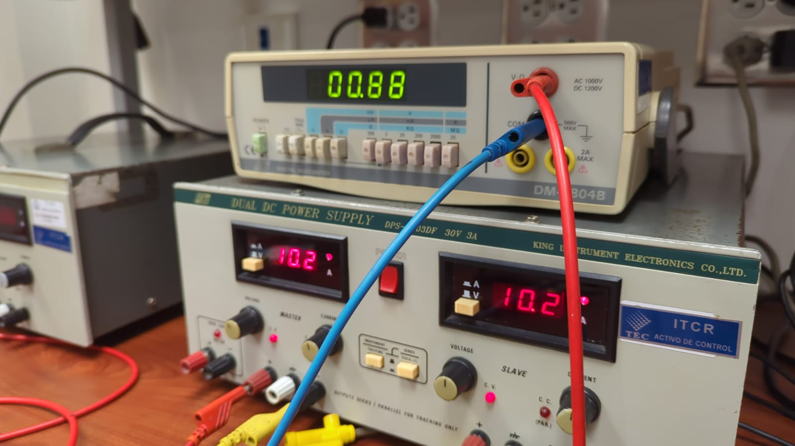
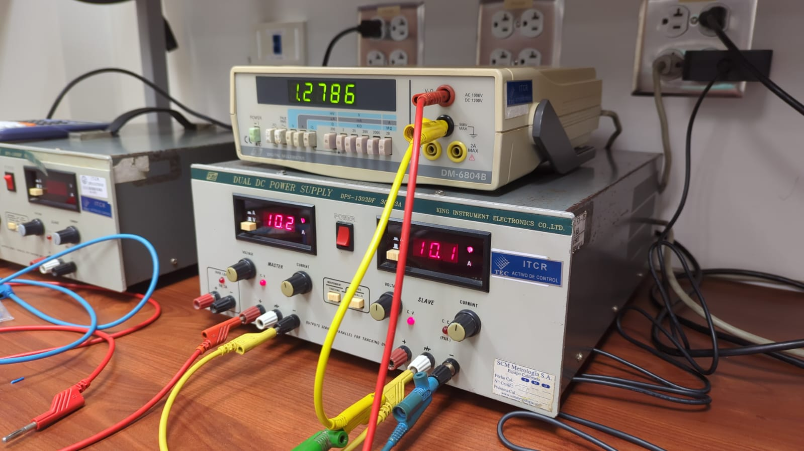
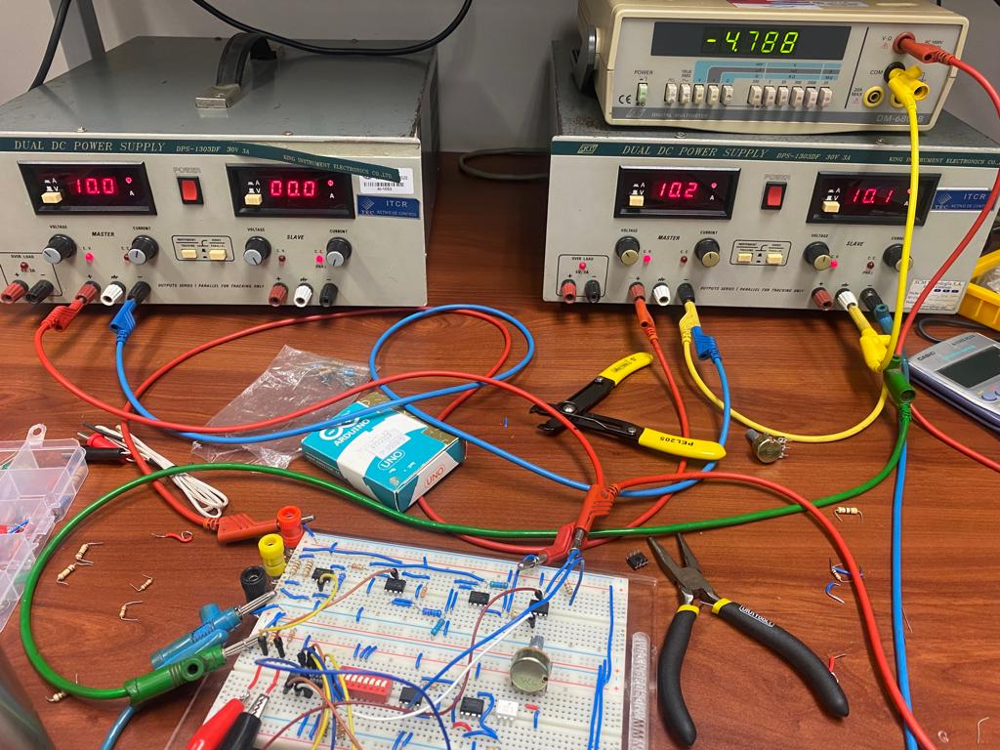
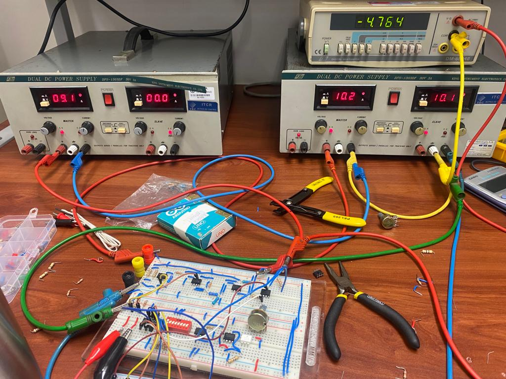
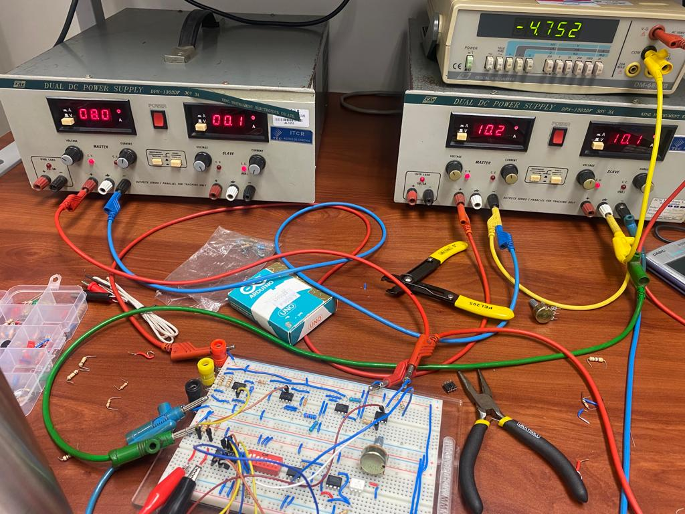
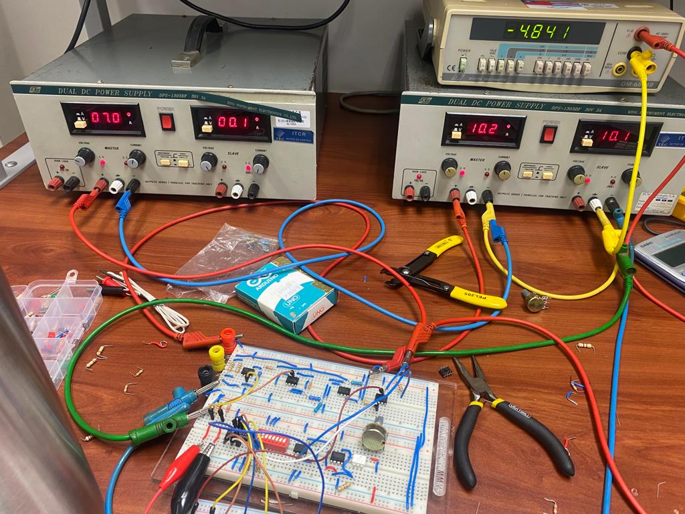
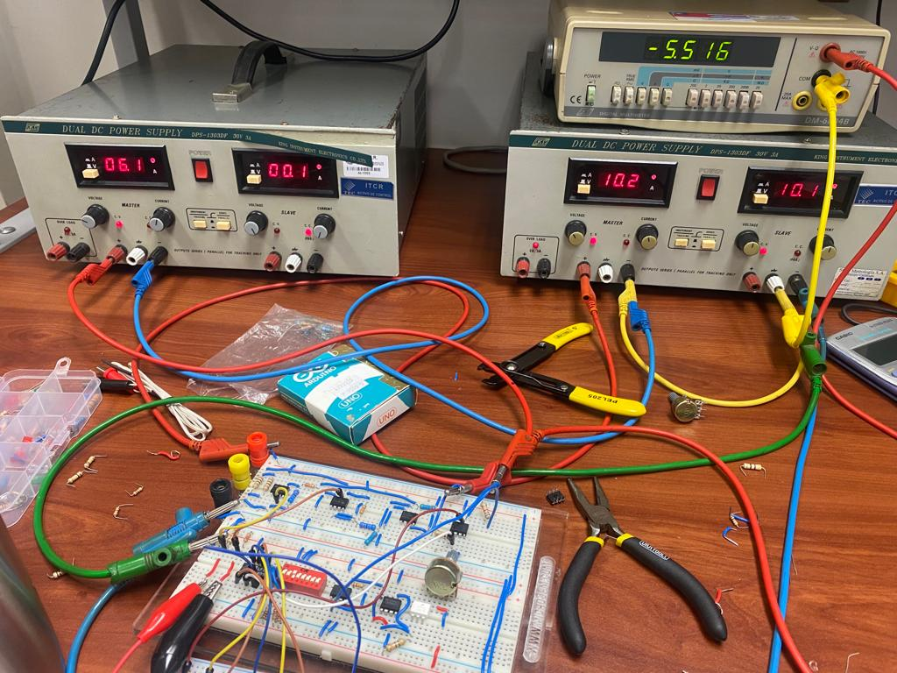
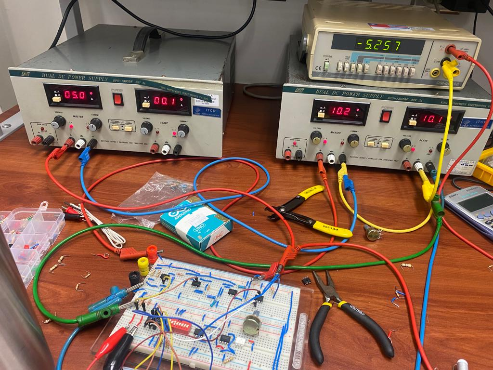

## Test

### 1. Etapa del amplificador de instrumentacion
El objetivo de la primera etapa era amplificar la señal de la termocupla lo suficiete para lograr ver al menos 1V a la salida, el resultado se aprecia en las siguientes imagenes:

### 3. Amplificador de ganancia programable
Para la presente etapa se hizo un arreglo de resistencias seleccionadas para que a la salida de esta etapa, dependiendo del voltaje programado siempre sea de 5V como maximo. Las siguientes imagenes muestran lo mencionado anteriormente:

Para esta etapa como la resistencias no son exactamente a las de la simulacion a la salida de dicha etapa la señal se atenuaba un poco, cabe destacar, que esta etapa estaba programada para 
